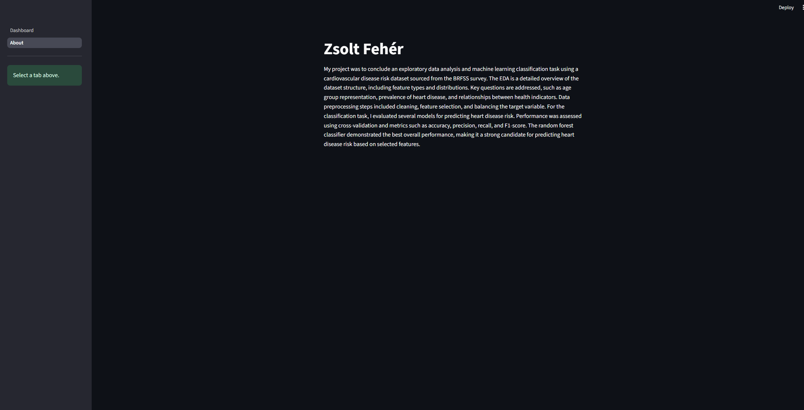

# PROHI Dashboard Example

**Author**: [Zsolt Fehér]
<!-- As main author, do not write anything in the line below.
The collaborator will edit the line below in GitHub -->
**Collaborator**: Samriddhi

## Introduction

_This template project will contain a simple interactive web dashboard with Streamlit. The Dashboard contains 3 input elements, a data table and a data chart. The About page contains a summary of my data science project._


### Installation of libraries

Run the commands below in a terminal to configure the project and install the package dependencies for the first time.

If you are using Mac, you may need to install Xcode. Check the official Streamlit documentation [here](https://docs.streamlit.io/get-started/installation/command-line#prerequisites).

1. Create the environment with `python -m venv env`
2. Activate the virtual environment for Python
   - [Linux/Mac] `source env/bin/activate` 
   - [Windows command prompt] `.\env\Scripts\activate.bat` 
   - [in Windows PowerShell] `.\env\Scripts\Activate.ps1`
3. Make sure that your terminal is in the environment (`env`) not in the global Python installation. The terminal should start with the word `env`
4. Install required packages `pip install -r ./requirements.txt`
5. Check that the installation works running `streamlit hello`
6. Stop the terminal by pressing **Ctrl+C**

### Execute Dashboard

First, make sure that you are running Python from the environment. Check the steps 2 and 3 above. Then, to run the custom dashboard execute the following command:

```
> streamlit run Dashboard.py
# If the command above fails, use:
> python -m streamlit run Dashboard.py
```


### Screenshots

_Here are the screenshots for how should the dashboard look like_



